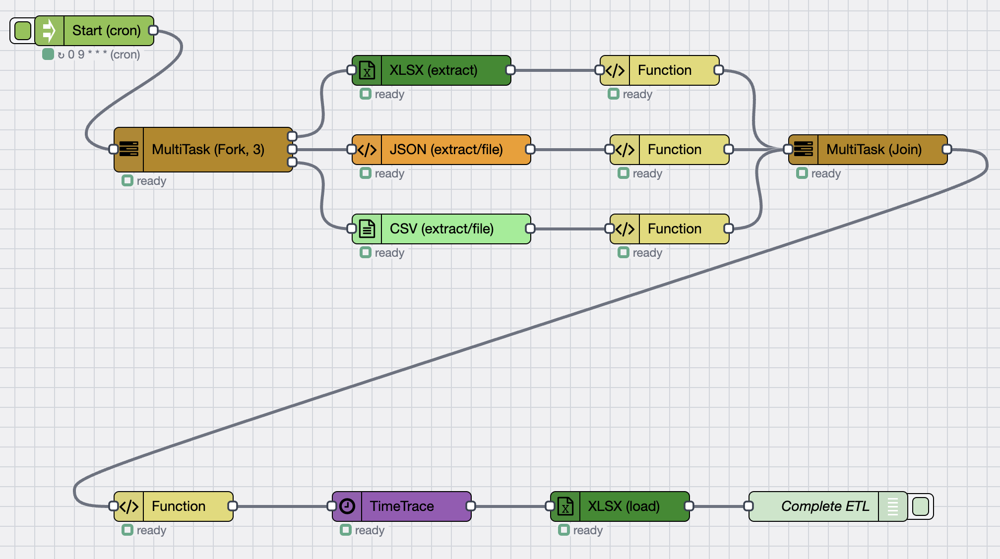

# Flow Design Pattern

Learn about the workflow architecture and design patterns used in the E-Commerce Store Daily ETL process.

## Workflow Architecture

The ETL workflow follows a parallel processing pattern to efficiently handle multiple data sources:

## Design Pattern: Parallel ETL

### Pattern Overview

The workflow uses a **Fork-Join pattern** to process multiple data sources in parallel:

1. **Start (Cron)** — triggers the workflow daily at 3 AM
2. **MultiTask (Fork, 3)** — splits the workflow into three parallel paths
3. **Parallel Extraction** — each path extracts data from one source simultaneously
4. **Parallel Transformation** — each path transforms its data independently
5. **MultiTask (Join)** — combines all three transformed data streams
6. **Final Processing** — additional transformations and validation
7. **Load** — uploads unified data to the cloud data warehouse

### Why Parallel Processing?

- **Performance** — processes three data sources simultaneously instead of sequentially
- **Efficiency** — reduces total processing time
- **Scalability** — easy to add more data sources by adding parallel paths
- **Isolation** — errors in one source don't affect others

## Workflow Components

### 1. Start Node (Cron Trigger)

- **Schedule**: `0 3 * * *` (daily at 3 AM)
- **Purpose**: Automatically trigger the workflow
- **Configuration**: Set timezone and retry policies

### 2. MultiTask Fork Node

- **Type**: Fork (splits into 3 paths)
- **Purpose**: Enable parallel processing
- **Configuration**: Set number of parallel paths

### 3. Extraction Nodes (Parallel)

- **Path 1**: XLSX extraction for `inventory.xlsx`
- **Path 2**: JSON extraction for `online_sales.json`
- **Path 3**: CSV extraction for `POS.csv`

### 4. Transformation Nodes (Parallel)

- Each path has a Function node for data transformation
- Standardizes formats specific to each data source
- Validates data quality

### 5. MultiTask Join Node

- **Type**: Join (combines 3 paths)
- **Purpose**: Merge all transformed data streams
- **Configuration**: Set merge strategy

### 6. Final Processing

- Additional Function node for final transformations
- TimeTrace node for monitoring
- Data validation and enrichment

### 7. Load Node

- XLSX (load) node
- Uploads to cloud data warehouse
- Complete ETL node marks workflow completion

## Best Practices

- **Use Parallel Processing** — for multiple independent data sources
- **Implement Error Handling** — at each step to handle failures gracefully
- **Add Monitoring** — use TimeTrace and logging nodes
- **Validate Data** — at each transformation step
- **Design for Scalability** — easy to add more data sources

## Next Steps

- [Extract Data](./extract-data) — learn how to configure data extraction
- [Transform Data](./transform-data) — learn data transformation techniques
- [Load Data](./load-data) — learn how to load data to the warehouse

