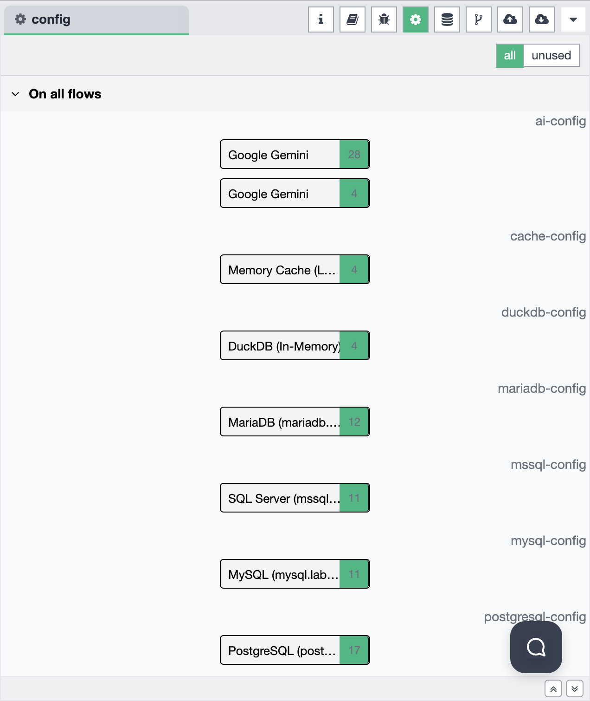

# Sidebar - Configuration Nodes

The Configuration Nodes panel provides access to manage and view all configuration nodes in your Synstream workflows. Configuration nodes are secure storage containers for sensitive information such as connection credentials, API keys, and other security-related data. The sidebar supports multiple functional modes that you can switch between to access different features.

## Sidebar Mode Selection

The sidebar allows you to choose from different functional modes. You can switch between modes using the mode selector in the sidebar:

Available modes include:
- **Information** — view workflow and node information
- **Help** — access help documentation and guides
- **Debug Messages** — monitor debug output and logs
- **Configuration Nodes** — manage configuration nodes
- **Context Data** — view and manage context data
- **Git Version Control** — manage Git operations
- **File Upload** — upload files to the system
- **File Download** — download files from the system

## Configuration Mode Overview

When the Configuration Nodes mode is selected, the sidebar provides a comprehensive interface for managing all configuration nodes across your workflows:

### Configuration Node Security

Configuration nodes are designed for secure storage of sensitive information:

- **Encrypted Storage** — all configuration node content is encrypted and securely stored
- **Secure Information** — typically used for storing:
  - Database connection credentials (usernames, passwords, connection strings)
  - API keys and authentication tokens
  - Service account credentials
  - Other security-sensitive configuration data
- **Safe Management** — configuration nodes can be shared across multiple workflows without exposing sensitive data

### Configuration Node Types

The Configuration panel displays all configuration nodes organized by type:

- **AI Configuration** (`ai-config`) — AI service configurations
  - Google Gemini configurations
  - OpenAI configurations
  - Anthropic configurations
  - Other AI service configurations
- **Database Configurations** — database connection configurations
  - `postgresql-config` — PostgreSQL database connections
  - `mysql-config` — MySQL database connections
  - `mariadb-config` — MariaDB database connections
  - `mssql-config` — SQL Server database connections
  - `duckdb-config` — DuckDB database configurations
- **Cache Configurations** (`cache-config`) — cache service configurations
  - Memory cache configurations
  - Redis configurations
  - Other cache service configurations

### Configuration Node Display

Each configuration node entry shows:

- **Configuration Name** — the name of the configuration node
- **Usage Count** — number indicating how many times the configuration is used across all workflows
- **Category** — the type of configuration (AI, database, cache, etc.)

### Filtering Options

The Configuration panel provides filtering capabilities:

- **All** — view all configuration nodes (default)
- **Unused** — filter to show only configuration nodes that are not currently used in any workflow

### Global Configuration Nodes

Configuration nodes can be:

- **Global** — available across all flows ("On all flows")
- **Flow-specific** — available only within a specific workflow

## Using Configuration Nodes

Configuration nodes allow you to:

1. **Centralize Credentials** — store connection information in one secure location
2. **Reuse Configurations** — use the same configuration across multiple nodes and workflows
3. **Secure Management** — manage sensitive information without exposing it in workflow definitions
4. **Easy Updates** — update connection information in one place, affecting all nodes that use it

## Best Practices

- **Use Configuration Nodes** — always use configuration nodes for storing sensitive information instead of hardcoding credentials
- **Name Clearly** — use descriptive names for configuration nodes to easily identify their purpose
- **Regular Review** — periodically review unused configuration nodes and remove them if no longer needed
- **Secure Access** — ensure proper access controls are in place for managing configuration nodes

## Usage

1. **Select Configuration Mode** — Click on the Configuration Nodes icon in the sidebar mode selector
2. **View All Configurations** — Browse all configuration nodes organized by type
3. **Filter Configurations** — Use the filter options to view all or only unused configurations
4. **Check Usage** — Review the usage count to see how many workflows use each configuration
5. **Manage Configurations** — Create, edit, or delete configuration nodes as needed

