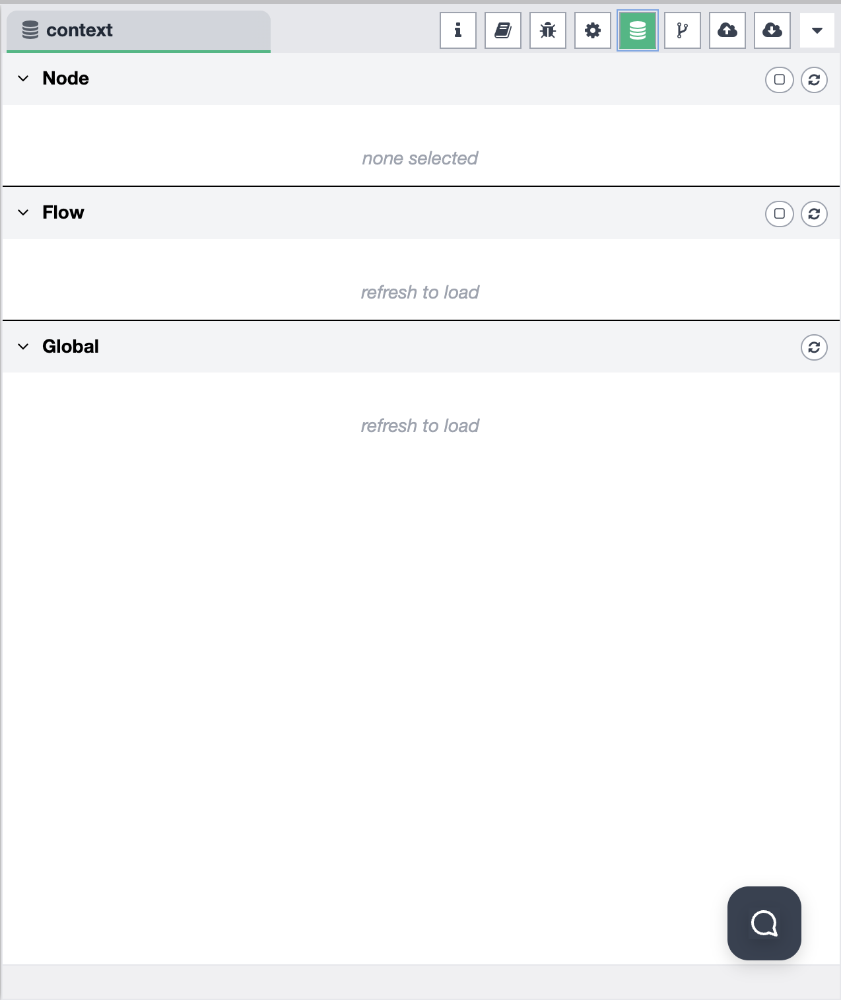

# Sidebar - Context Data

The Context Data panel displays workflow context and runtime data during workflow execution. The sidebar supports multiple functional modes that you can switch between to access different features.

## Sidebar Mode Selection

The sidebar allows you to choose from different functional modes. You can switch between modes using the mode selector in the sidebar:

Available modes include:
- **Information** — view workflow and node information
- **Help** — access help documentation and guides
- **Debug Messages** — monitor debug output and logs
- **Configuration Nodes** — manage configuration nodes
- **Context Data** — view and manage context data
- **Git Version Control** — manage Git operations
- **File Upload** — upload files to the system
- **File Download** — download files from the system

## Context Data Mode Overview

When the Context Data mode is selected, the sidebar provides a comprehensive interface for viewing and managing workflow context and runtime data:

### Context Data Features

The Context Data panel allows you to:

- **View Workflow Context** — inspect context variables and data available throughout the workflow
- **Monitor Runtime State** — track runtime data and state during workflow execution
- **Inspect Message Payloads** — examine message payloads and data structures
- **Manage Environment Variables** — view and manage environment variables used by the workflow

### Context Variables

Context variables are data that can be shared and accessed across different nodes in a workflow:

- **Global Context** — variables available to all nodes in the workflow
- **Node Context** — variables specific to individual nodes
- **Flow Context** — variables scoped to the current flow
- **Persistent Context** — variables that persist across workflow executions

### Runtime Data

The Context Data panel displays:

- **Current State** — the current state of workflow execution
- **Active Variables** — variables currently in use
- **Data Structures** — complex data structures and objects
- **Execution Context** — information about the current execution environment

### Message Inspection

You can inspect message payloads and data:

- **Message Payloads** — view the content of messages flowing through the workflow
- **Data Types** — see the data types of variables and payloads
- **Object Properties** — expand objects to view all properties and nested structures
- **Array Contents** — inspect array elements and their values

### Environment Variables

The Context Data panel provides access to:

- **System Environment Variables** — environment variables from the system
- **Workflow Environment Variables** — variables specific to the workflow
- **Node Environment Variables** — variables available to specific nodes

## Using Context Data

Context data is useful for:

1. **Debugging** — understand what data is available at different points in the workflow
2. **Data Flow Tracking** — track how data flows through the workflow
3. **Variable Management** — manage and update context variables
4. **State Inspection** — inspect the current state of workflow execution

## Usage

1. **Select Context Data Mode** — Click on the Context Data icon in the sidebar mode selector
2. **View Context Variables** — Browse all available context variables in the current workflow
3. **Inspect Runtime Data** — Monitor runtime data and state during workflow execution
4. **Examine Messages** — Click on messages to view their payloads and data structures
5. **Manage Environment Variables** — View and manage environment variables as needed

