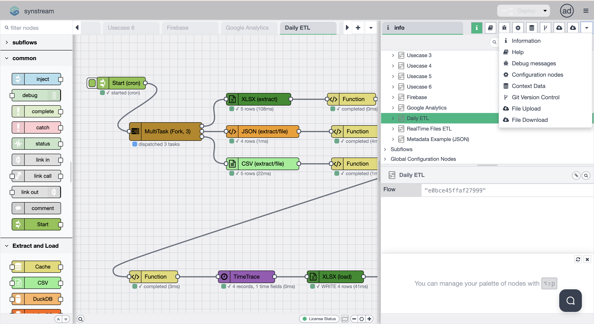
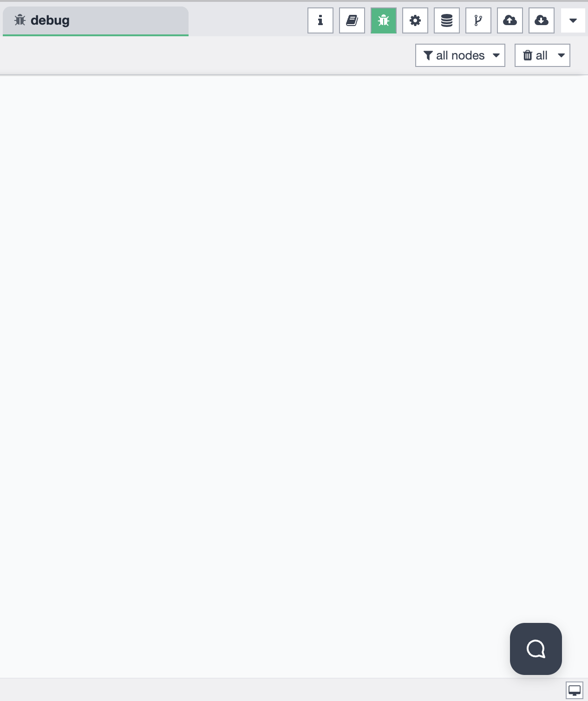
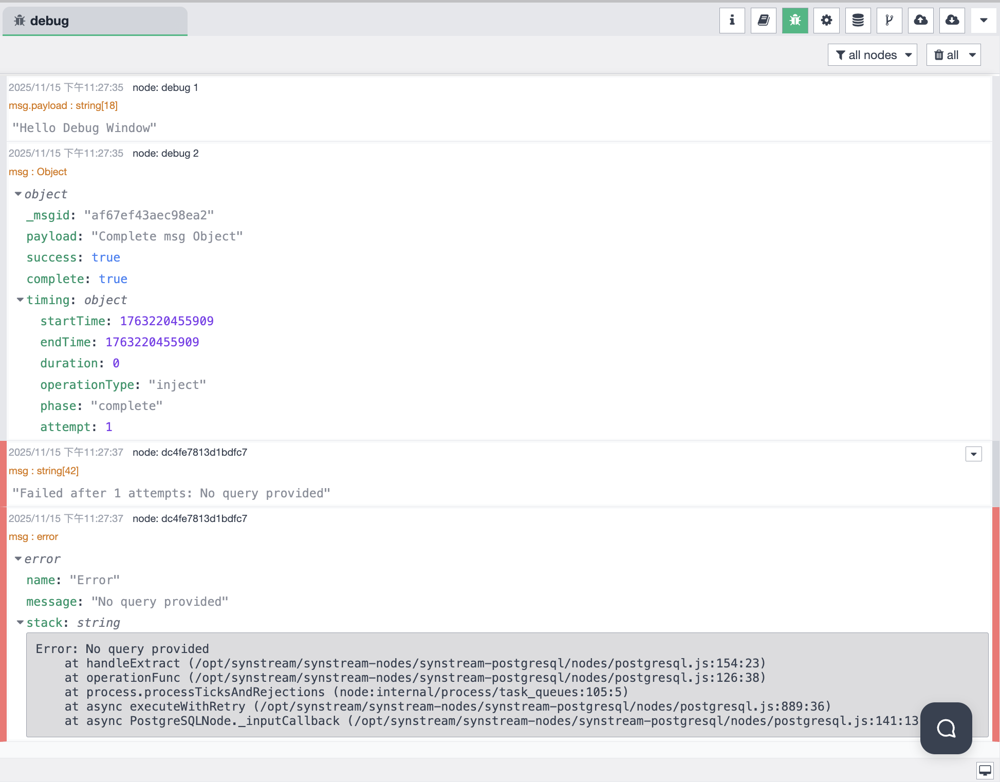

# Sidebar - Debug Messages

The Debug Messages panel displays real-time debugging information and logs during workflow execution. The sidebar supports multiple functional modes that you can switch between to access different features.

## Sidebar Mode Selection

The sidebar allows you to choose from different functional modes. You can switch between modes using the mode selector in the sidebar:

Available modes include:
- **Information** — view workflow and node information
- **Help** — access help documentation and guides
- **Debug Messages** — monitor debug output and logs
- **Configuration Nodes** — manage configuration nodes
- **Context Data** — view and manage context data
- **Git Version Control** — manage Git operations
- **File Upload** — upload files to the system
- **File Download** — download files from the system

## Debug Mode Overview

When the Debug Messages mode is selected, the sidebar provides a comprehensive debugging interface for monitoring workflow execution:

### Debug Interface Features

The Debug panel includes:

- **Filter Controls** — filter debug messages by node or message type
  - **Node Filter** — select "all nodes" or filter by specific nodes
  - **Message Type Filter** — select "all" messages or filter by type
- **Real-time Log Display** — view debug messages as they are generated during workflow execution
- **Message Details** — expand messages to view full details and stack traces

## Debug Message Types

The Debug panel can display various types of messages through debug nodes in your workflow. Here are examples of different message types:

### Single Message Output

Debug nodes can output simple string messages:

- **Message Type:** `msg.payload: string[18]`
- **Payload:** `"Hello Debug Window"`
- **Display:** Shows the message content directly in the debug panel

### Complete Object Output

Debug nodes can output complete message objects with all properties:

- **Message Type:** `msg: Object`
- **Properties Displayed:**
  - `_msgid` — unique message identifier
  - `payload` — message payload content
  - `success` — success status flag
  - `complete` — completion status flag
  - `timing` — execution timing information
    - `startTime` — when the operation started
    - `endTime` — when the operation completed
    - `duration` — total execution time
    - `operationType` — type of operation performed
    - `phase` — current execution phase
    - `attempt` — retry attempt number

### Error Messages

Debug nodes can capture and display error messages with full stack traces:

- **Message Type:** `msg: error`
- **Error Display:**
  - **Error Name:** e.g., `"Error"`
  - **Error Message:** e.g., `"No query provided"`
  - **Stack Trace:** Full JavaScript stack trace showing:
    - Error location in the code
    - Function call chain
    - File paths and line numbers
    - Example: `Error: No query provided at handleExtract (/opt/synstream/synstream-nodes/synstream-postgresql/nodes/postgresql.js:154:23)`

### Message Filtering

The Debug panel provides filtering options:

- **Filter by Node** — view messages from specific nodes only
- **Filter by Type** — filter messages by type (all, success, error, warning)
- **Clear Filters** — reset filters to view all messages

## Using Debug Nodes

To display messages in the Debug panel, use debug nodes in your workflow:

1. **Add Debug Node** — drag a debug node from the node palette into your workflow
2. **Configure Debug Node** — set the debug node to output:
   - `msg.payload` — for simple string messages
   - `msg` — for complete message objects
   - `msg.error` — for error messages
3. **Connect to Workflow** — connect the debug node to nodes you want to monitor
4. **View Messages** — messages will appear in the Debug panel in real-time

## Message Display Format

Each debug message in the panel shows:

- **Timestamp** — when the message was generated (e.g., `2025/11/15 下午11:27:35`)
- **Node Name** — the node that generated the message (e.g., `debug 1`, `debug 2`)
- **Message Type** — the type of data being displayed
- **Message Content** — the actual message payload or object
- **Expandable Details** — click to expand and view full object properties or stack traces

## Usage

1. **Select Debug Mode** — Click on the Debug Messages icon in the sidebar mode selector
2. **Add Debug Nodes** — Place debug nodes in your workflow to capture messages
3. **Configure Filters** — Use the filter dropdowns to focus on specific nodes or message types
4. **Monitor Execution** — Run your workflow and watch messages appear in real-time
5. **Inspect Details** — Click on messages to expand and view full details
6. **Troubleshoot Errors** — Use error messages and stack traces to identify and fix issues

