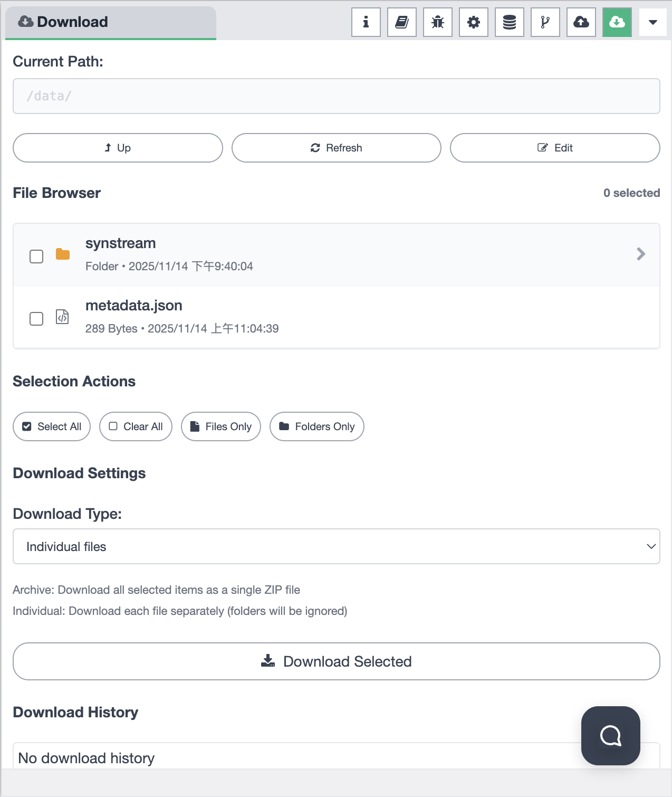
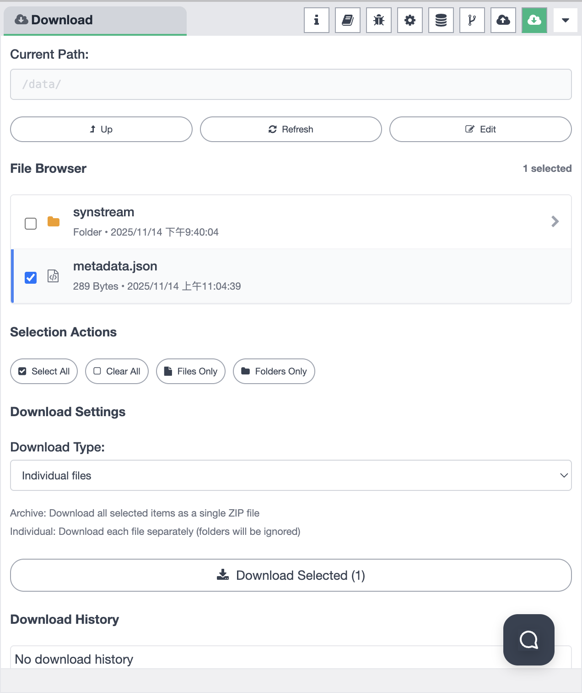
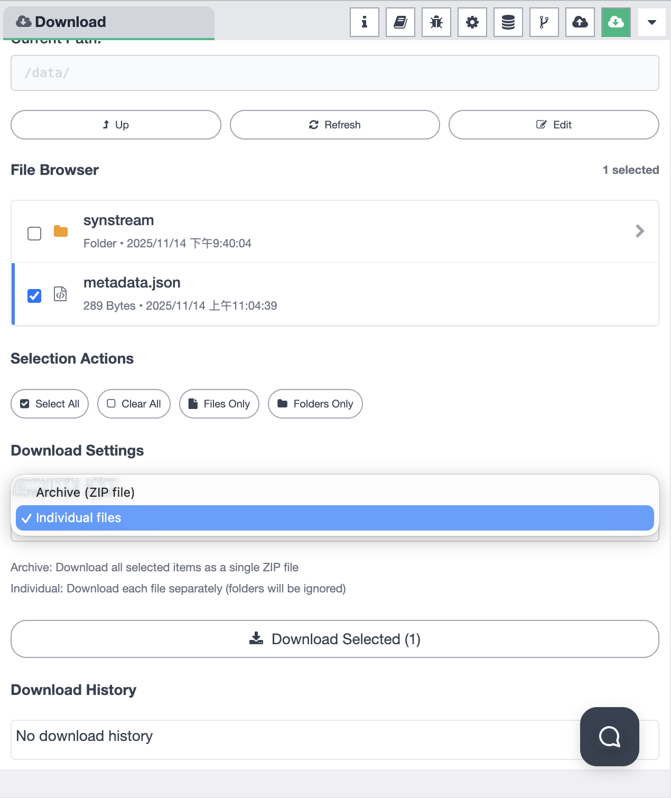

# Sidebar - File Download

The File Download panel provides comprehensive file download functionality for your Synstream workflows. You can browse files, select items to download, choose download formats, and view download history. The sidebar supports multiple functional modes that you can switch between to access different features.

## Sidebar Mode Selection

The sidebar allows you to choose from different functional modes. You can switch between modes using the mode selector in the sidebar:

Available modes include:
- **Information** — view workflow and node information
- **Help** — access help documentation and guides
- **Debug Messages** — monitor debug output and logs
- **Configuration Nodes** — manage configuration nodes
- **Context Data** — view and manage context data
- **Git Version Control** — manage Git operations
- **File Upload** — upload files to the system
- **File Download** — download files from the system

## File Download Overview

When the File Download mode is selected, the sidebar provides a complete file download interface:

### Download Interface Components

The File Download panel consists of several key sections:

1. **Current Path** — displays the current directory being browsed
2. **Navigation Actions** — buttons to navigate directories and refresh
3. **File Browser** — list of files and folders with selection capabilities
4. **Selection Actions** — tools to manage file selections
5. **Download Settings** — configure download type and options
6. **Download History** — view past download records

## Current Path Navigation

The Current Path section shows:

- **Path Display** — the current directory path (e.g., `/data/`)
- **Path Input Field** — editable field to directly enter or view the path
- **Navigation Buttons**:
  - **Up** — navigate to the parent directory
  - **Refresh** — refresh the file list to show latest files
  - **Edit** — edit file or folder properties

## File Browser

The File Browser section displays files and folders in the current directory:

### File Display

Each file or folder entry shows:
- **Checkbox** — select individual items for download
- **Icon** — visual indicator of file type (folder, JSON, etc.)
- **Name** — file or folder name
- **Type** — file type (e.g., "Folder", "JSON")
- **Size** — file size (e.g., `289 Bytes`)
- **Last Modified** — modification timestamp (e.g., `2025/11/14 上午11:04:39`)
- **Navigation Arrow** — for folders, click to enter the folder

### Selection Counter

The File Browser header shows:
- **Selection Count** — number of items currently selected (e.g., "1 selected", "0 selected")

## Selecting Files

To select files for download, use the checkboxes in the File Browser:

### File Selection Process

1. **Browse Files** — navigate to the directory containing files you want to download
2. **Select Items** — click checkboxes next to files or folders to select them
3. **Multiple Selection** — select multiple files and folders simultaneously
4. **Visual Feedback** — selected items are highlighted in blue
5. **Selection Counter** — the header shows how many items are selected

### Selection Actions

The Selection Actions section provides tools to manage selections:

- **Select All** — select all items in the current directory
- **Clear All** — deselect all currently selected items
- **Files Only** — select only files (exclude folders)
- **Folders Only** — select only folders (exclude files)

## Download Settings

The Download Settings section allows you to configure how files are downloaded:

### Download Type Options

You can choose between two download modes:

#### Archive (ZIP file)

- **Description** — "Download all selected items as a single ZIP file"
- **Behavior**:
  - All selected files and folders are packaged into a single ZIP archive
  - Preserves folder structure within the ZIP
  - Convenient for downloading multiple items at once
  - Single file download

#### Individual Files

- **Description** — "Download each file separately (folders will be ignored)"
- **Behavior**:
  - Each selected file is downloaded separately
  - Folders are ignored (only files are downloaded)
  - Multiple download operations for multiple files
  - Useful when you only need specific files

### Download Button

The download button shows:
- **Button Label** — "Download Selected (X)" where X is the number of selected items
- **Download Icon** — visual indicator for download action
- **Action** — click to initiate the download with the selected mode

## Download History

The Download History section displays a record of all past downloads:

- **History Display** — shows download records when available
- **Empty State** — displays "No download history" when no downloads have been made
- **Search Function** — magnifying glass icon for searching through history

## Usage

1. **Select File Download Mode** — Click on the File Download icon in the sidebar mode selector
2. **Navigate to Directory** — Use the path input or navigation buttons to browse to the desired directory
3. **Select Files** — Click checkboxes to select files and folders you want to download
4. **Use Selection Actions** — Use "Select All", "Clear All", "Files Only", or "Folders Only" to manage selections
5. **Choose Download Mode** — Select either "Archive (ZIP file)" or "Individual files" based on your needs
6. **Start Download** — Click "Download Selected" to begin downloading
7. **View History** — Check the download history to see past downloads

