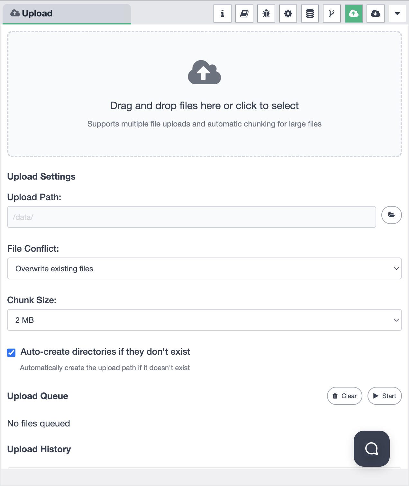
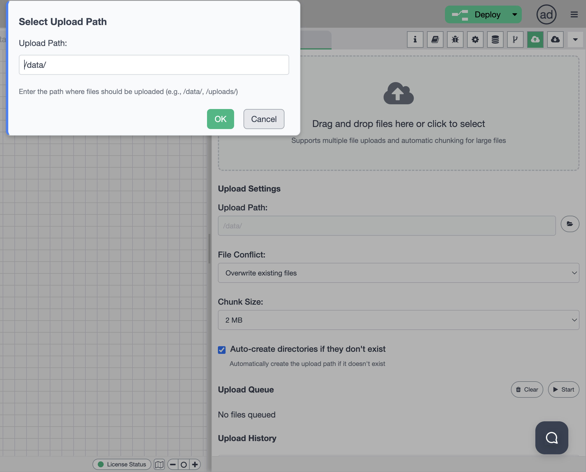
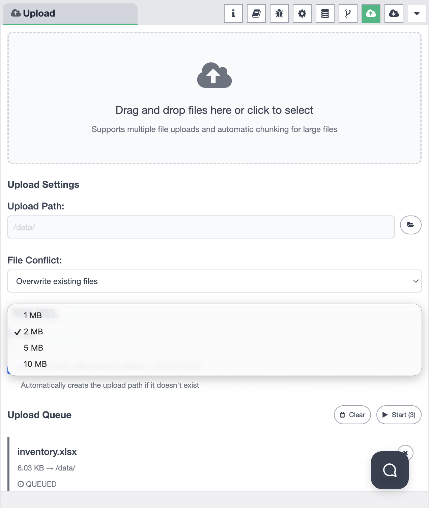
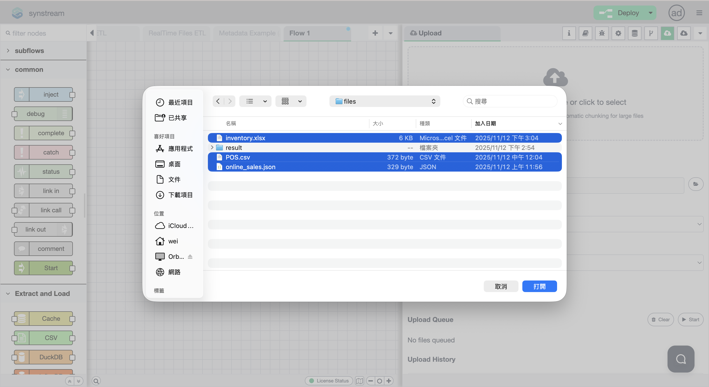
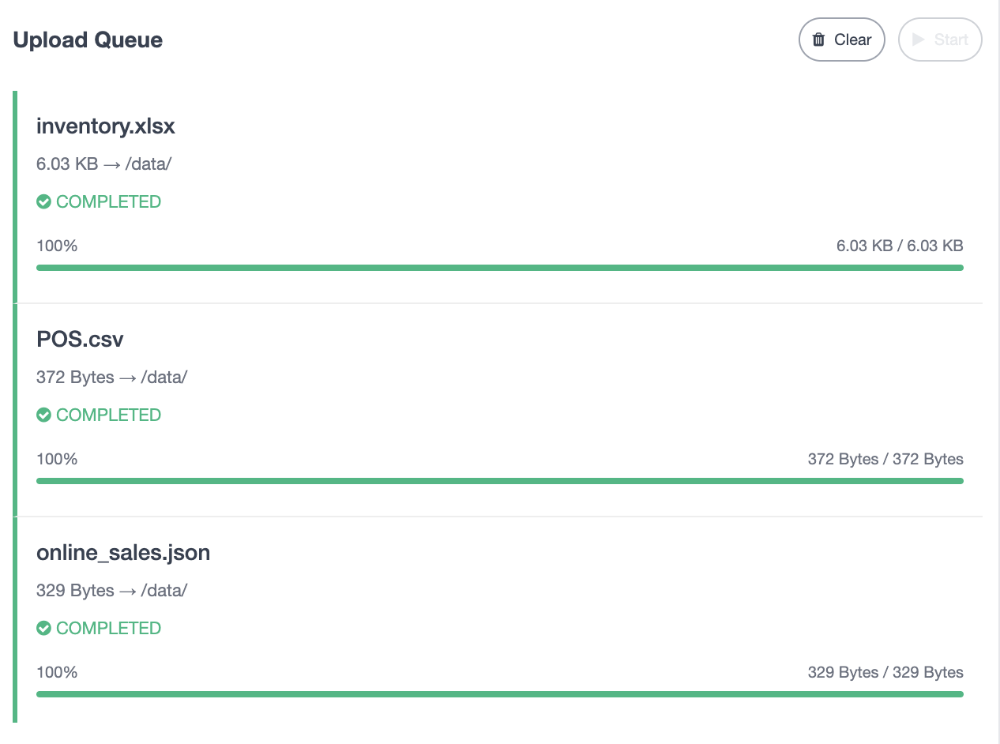
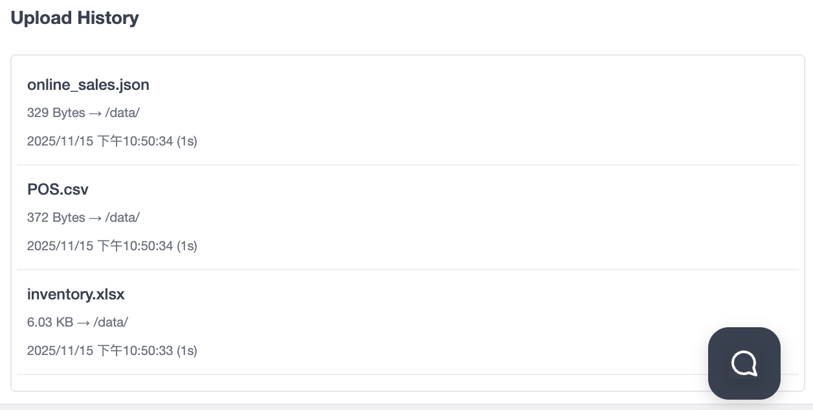

# Sidebar - File Upload

The File Upload panel provides comprehensive file upload functionality for your Synstream workflows. You can upload files, configure upload settings, manage upload queues, and view upload history. The sidebar supports multiple functional modes that you can switch between to access different features.

## Sidebar Mode Selection

The sidebar allows you to choose from different functional modes. You can switch between modes using the mode selector in the sidebar:

Available modes include:
- **Information** — view workflow and node information
- **Help** — access help documentation and guides
- **Debug Messages** — monitor debug output and logs
- **Configuration Nodes** — manage configuration nodes
- **Context Data** — view and manage context data
- **Git Version Control** — manage Git operations
- **File Upload** — upload files to the system
- **File Download** — download files from the system

## File Upload Overview

When the File Upload mode is selected, the sidebar provides a complete file upload interface:

### Upload Interface Components

The File Upload panel consists of several key sections:

1. **Drag and Drop Area** — primary area for selecting files
2. **Upload Settings** — configuration options for upload behavior
3. **Upload Queue** — manage files waiting to be uploaded
4. **Upload History** — view past upload records

## Drag and Drop Upload

The main upload area supports multiple upload methods:

- **Drag and Drop** — drag files from your file system and drop them into the upload area
- **Click to Select** — click the upload area to open a file selection dialog
- **Multiple Files** — select and upload multiple files simultaneously
- **Automatic Chunking** — large files are automatically split into chunks for reliable upload

The upload area displays:
- A cloud icon with an upward arrow
- Instructions: "Drag and drop files here or click to select"
- Information: "Supports multiple file uploads and automatic chunking for large files"

## Upload Settings

The Upload Settings section allows you to configure how files are uploaded:

### Upload Path

Configure the destination path where files will be uploaded:

- **Path Input Field** — enter the destination path (e.g., `/data/`)
- **Browse Button** — click the folder icon to open a path selection dialog
- **Path Selection Dialog** — modal dialog to select or enter the upload path
  - Enter the path where files should be uploaded
  - Example paths: `/data/`, `/uploads/`
  - Click "OK" to confirm or "Cancel" to abort

### File Conflict Resolution

Configure how to handle files that already exist at the destination:

Available options:
- **Overwrite existing files** — replace existing files with the same name
- **Skip existing files** — keep existing files and skip uploading duplicates

### Chunk Size

Configure the chunk size for large file uploads:

Available chunk sizes:
- **1 MB** — smaller chunks, more reliable but slower
- **2 MB** — default, balanced option
- **5 MB** — larger chunks, faster upload
- **10 MB** — largest chunks, fastest upload for stable connections

Chunking helps with:
- **Reliability** — resume uploads if interrupted
- **Progress Tracking** — monitor upload progress in real-time
- **Large Files** — handle files that are too large for single upload

### Auto-create Directories

- **Checkbox Option** — "Auto-create directories if they don't exist"
- **Description** — "Automatically create the upload path if it doesn't exist"
- **Behavior** — when enabled, the system will create the full directory path if it doesn't already exist

## Selecting Files

To select files for upload, you can use the file selection dialog:

### File Selection Process

1. **Open File Dialog** — click the upload area or use the file browser
2. **Navigate Directories** — browse through your file system using the left navigation pane
3. **Select Files** — click on files to select them (multiple selection supported)
4. **Selected Files** — highlighted files are shown in blue
5. **Confirm Selection** — click "Open" to add files to the upload queue

### File Selection Features

- **Multiple Selection** — select multiple files at once
- **File Information** — view file name, size, type, and date added
- **Search** — use the search bar to quickly find files
- **Recent Items** — access recently used files and folders

## Upload Queue

The Upload Queue section shows files waiting to be uploaded:

### Queue Display

Each file in the queue shows:
- **File Name** — the name of the file to be uploaded
- **File Size** — size of the file (e.g., `6.03 KB`, `372 Bytes`)
- **Destination Path** — where the file will be uploaded (e.g., `→ /data/`)
- **Status** — current upload status:
  - `QUEUED` — file is waiting to be uploaded
  - `UPLOADING` — file is currently being uploaded
  - `COMPLETED` — file has been successfully uploaded
  - `FAILED` — upload encountered an error
- **Progress Bar** — visual progress indicator showing upload percentage
- **Progress Details** — shows uploaded size vs. total size (e.g., `6.03 KB / 6.03 KB`)

### Queue Actions

- **Start Button** — begin uploading queued files (shows count, e.g., "Start (3)")
- **Clear Button** — remove all files from the queue
- **Individual File Actions** — manage individual files in the queue

### Upload Progress

During upload, you can monitor:
- **Real-time Progress** — see upload progress as it happens
- **Percentage Complete** — visual progress bar with percentage
- **Speed Information** — upload speed and estimated time remaining
- **Status Updates** — real-time status changes

## Upload History

The Upload History section displays a record of all past uploads:

### History Display

Each history entry shows:
- **File Name** — name of the uploaded file
- **File Size** — size of the uploaded file
- **Destination Path** — where the file was uploaded
- **Upload Timestamp** — when the file was uploaded (e.g., `2025/11/15 下午10:50:34`)
- **Upload Duration** — how long the upload took (e.g., `1 second`)

### History Features

- **Chronological Order** — most recent uploads appear first
- **Complete Record** — all uploads are logged with full details
- **Quick Reference** — easily find previously uploaded files
- **Upload Tracking** — track upload activity over time

## Usage

1. **Select File Upload Mode** — Click on the File Upload icon in the sidebar mode selector
2. **Configure Upload Settings** — Set the upload path, conflict resolution, chunk size, and auto-create directories option
3. **Select Files** — Drag and drop files or click to select files from your file system
4. **Review Queue** — Check the upload queue to see selected files
5. **Start Upload** — Click "Start" to begin uploading files
6. **Monitor Progress** — Watch the upload progress in the queue
7. **View History** — Check the upload history to see past uploads

