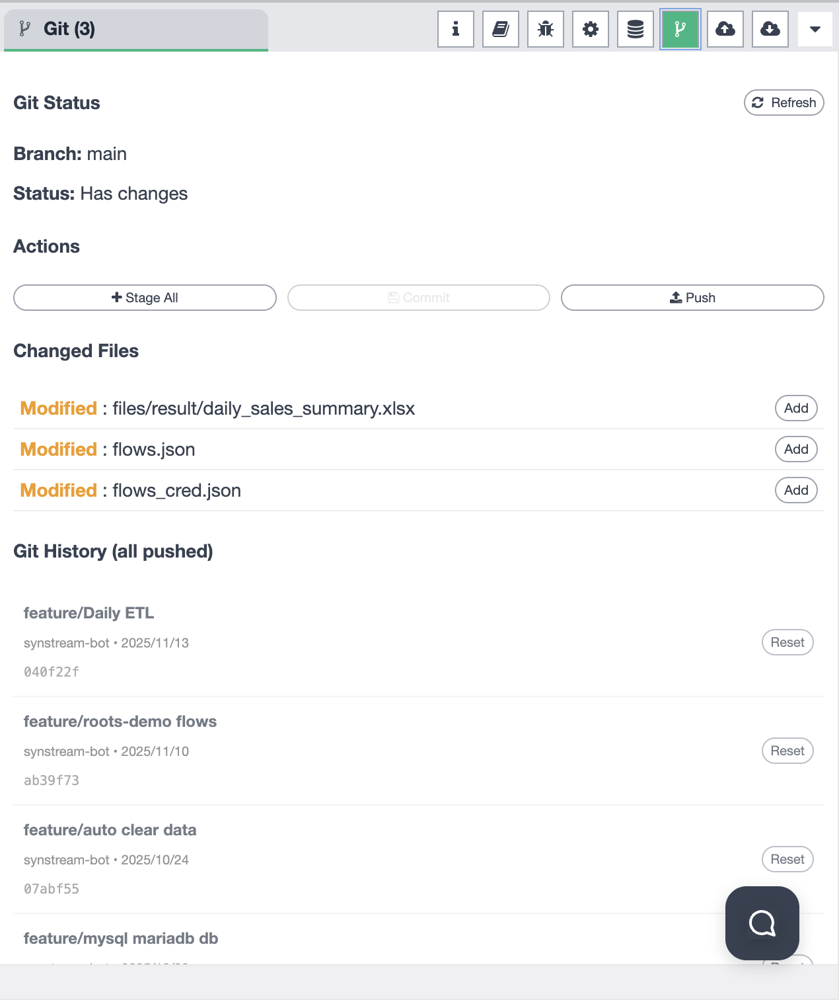
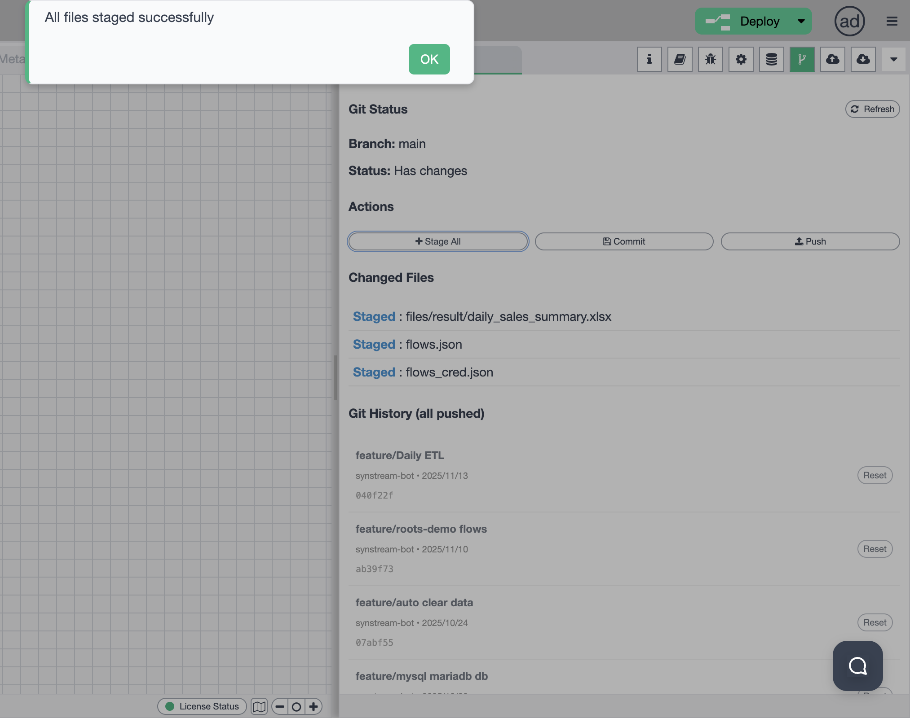
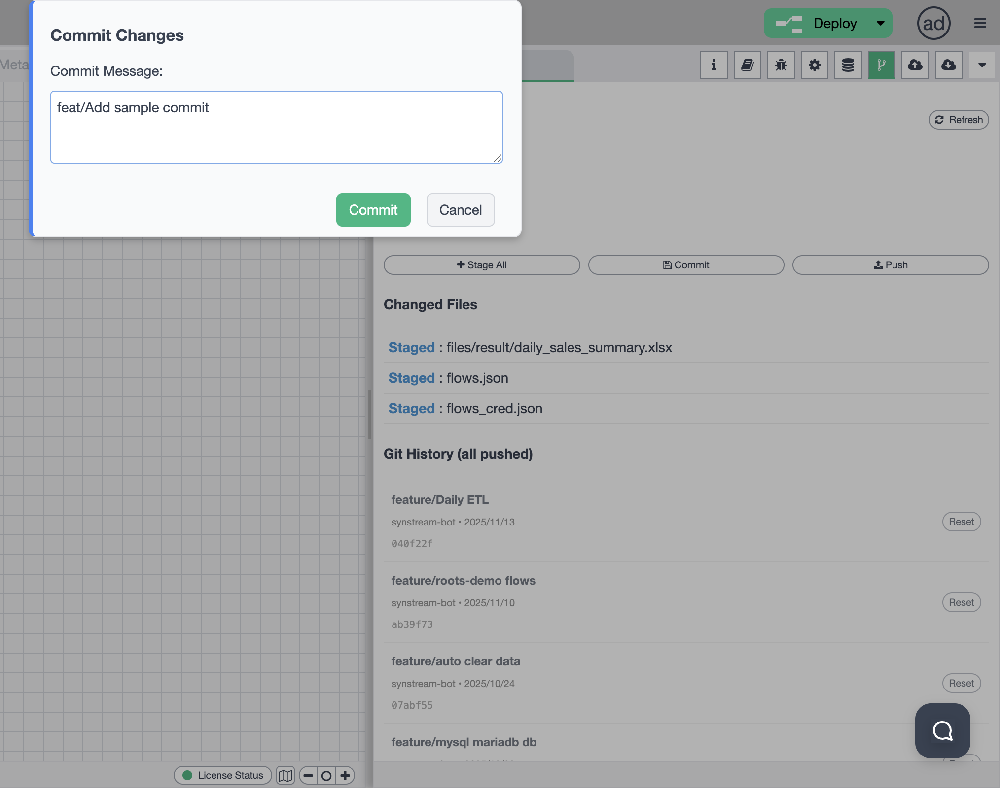

# Sidebar - Git Version Control

The Git Version Control panel provides comprehensive version control functionality for your Synstream workflows. You can manage your flows using Git operations directly within the Synstream interface. The sidebar supports multiple functional modes that you can switch between to access different features.

## Sidebar Mode Selection

The sidebar allows you to choose from different functional modes. You can switch between modes using the mode selector in the sidebar:

Available modes include:
- **Information** — view workflow and node information
- **Help** — access help documentation and guides
- **Debug Messages** — monitor debug output and logs
- **Configuration Nodes** — manage configuration nodes
- **Context Data** — view and manage context data
- **Git Version Control** — manage Git operations
- **File Upload** — upload files to the system
- **File Download** — download files from the system

## Git Version Control Overview

When the Git Version Control mode is selected, the sidebar provides a complete Git management interface for your workflows:

### Git Management for Flows

The Git Version Control panel allows you to manage your flows using Git operations:

- **Version Control** — track changes to your workflows over time
- **Branch Management** — work with different branches for your flows
- **Commit Workflows** — commit changes to your workflow files
- **Push Changes** — push your commits to remote repositories
- **History Tracking** — view complete commit history
- **Rollback Capabilities** — restore previous versions of your workflows

### Git Status Display

The Git panel shows:

- **Current Branch** — the branch you're currently working on (e.g., `main`)
- **Status** — current Git status:
  - `Has changes` — indicates uncommitted modifications
  - `Clean` — no uncommitted changes
- **Changed Files** — list of files that have been modified
- **Git History** — complete history of all pushed commits

### Git Actions

The panel provides three main action buttons:

- **Stage All** — stage all modified files for commit
- **Commit** — commit staged changes with a message
- **Push** — push committed changes to the remote repository

## Staging Files

To stage files for commit, use the "Stage All" button:

### Staging Process

1. **View Changed Files** — the panel lists all modified files:
   - Workflow files (e.g., `flows.json`)
   - Configuration files (e.g., `flows_cred.json`)
   - Result files (e.g., `files/result/daily_sales_summary.xlsx`)

2. **Stage Files** — click "Stage All" to stage all modified files
   - Files will show as "Staged" in the Changed Files section
   - A success notification will appear: "All files staged successfully"

3. **Individual Staging** — you can also stage individual files using the "Add" button next to each file

### Staged Files Display

After staging, files are displayed with:
- **Status:** `Staged : [file path]`
- **File Path:** the full path to the staged file
- **Visual Indicator:** staged files are clearly marked in the interface

## Committing Changes

After staging files, you can commit your changes with a descriptive message:

### Commit Process

1. **Open Commit Dialog** — click the "Commit" button after staging files
2. **Enter Commit Message** — a modal dialog appears with a text input field:
   - Label: "Commit Message:"
   - Enter a descriptive message (e.g., `feat/Add sample commit`)
3. **Commit Changes** — click the green "Commit" button to commit
4. **Cancel** — click "Cancel" to abort the commit operation

### Commit Message Best Practices

- Use descriptive messages that explain what changes were made
- Follow conventional commit format (e.g., `feat/`, `fix/`, `docs/`)
- Include relevant context about the workflow changes

## Pushing Changes

After committing, you can push your changes to the remote repository:

### Push Process

1. **Verify Status** — ensure your changes are committed (status shows "Clean")
2. **Push Changes** — click the "Push" button
3. **Success Notification** — a confirmation dialog appears: "Changes pushed successfully"
4. **Updated History** — the commit appears in the Git History section

### Git History

The Git History section displays all pushed commits with:

- **Commit Message** — the commit message (e.g., `feat/Add sample commit`, `feature/Daily ETL`)
- **Author** — who made the commit (e.g., `synstream-bot`)
- **Date** — when the commit was made (e.g., `2025/11/15`)
- **Commit Hash** — short commit hash (e.g., `aba148a`, `040f22f`)
- **Reset Option** — a "Reset" button to rollback to that commit

### Reset Functionality

You can reset to any previous commit using the "Reset" button:

- **Rollback** — restore your workflows to a previous state
- **History Access** — easily access any commit in your history
- **Safe Operation** — reset operations are tracked in Git history

## Workflow File Management

The Git Version Control panel manages:

- **Flow Definitions** — `flows.json` files containing workflow definitions
- **Configuration Files** — `flows_cred.json` files with encrypted credentials
- **Result Files** — output files generated by workflows (e.g., `files/result/*.xlsx`)

## Usage

1. **Select Git Mode** — Click on the Git Version Control icon in the sidebar mode selector
2. **Check Status** — Review the current Git status and changed files
3. **Stage Files** — Click "Stage All" or stage individual files
4. **Commit Changes** — Enter a commit message and commit your changes
5. **Push to Remote** — Push your commits to the remote repository
6. **View History** — Browse commit history and reset to previous versions if needed
7. **Refresh** — Use the refresh button to update the Git status

