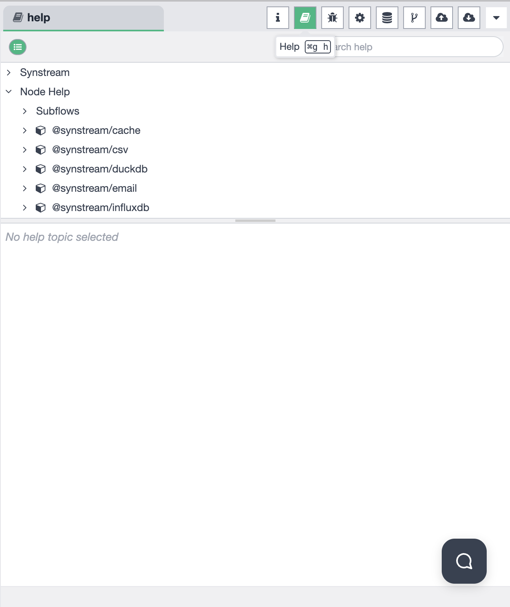
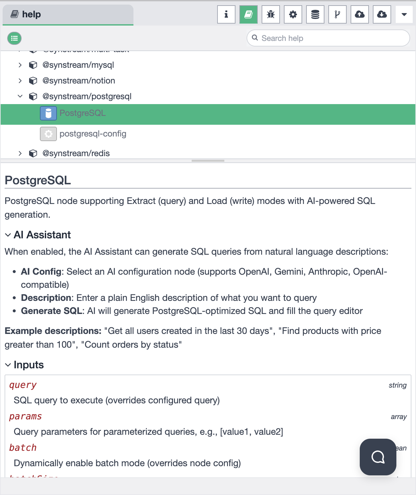

# Sidebar - Help

The Help panel provides comprehensive documentation and assistance for using Synstream nodes and features. The sidebar supports multiple functional modes that you can switch between to access different features.

## Sidebar Mode Selection

The sidebar allows you to choose from different functional modes. You can switch between modes using the mode selector in the sidebar:

Available modes include:
- **Information** — view workflow and node information
- **Help** — access help documentation and guides
- **Debug Messages** — monitor debug output and logs
- **Configuration Nodes** — manage configuration nodes
- **Context Data** — view and manage context data
- **Git Version Control** — manage Git operations
- **File Upload** — upload files to the system
- **File Download** — download files from the system

## Help Mode Overview

When the Help mode is selected, the sidebar provides access to comprehensive documentation for all available nodes in Synstream:

### Node Documentation Browser

The Help panel displays a hierarchical navigation structure that organizes all available nodes:

- **Synstream** — main category for Synstream core features
- **Node Help** — comprehensive documentation for all nodes
  - **Subflows** — documentation for subflow nodes
  - **Node Categories** — nodes organized by type (e.g., `@synstream/cache`, `@synstream/csv`, `@synstream/duckdb`, `@synstream/email`, `@synstream/influxdb`, `@synstream/mysql`, `@synstream/postgresql`, `@synstream/redis`)

### Search Functionality

The Help panel includes a search bar that allows you to:

- **Search help topics** — quickly find documentation for specific nodes or features
- **Filter nodes** — locate nodes by name or category
- **Keyboard shortcut** — use `⌘g h` to quickly access help search

## Node Documentation Details

When you select a specific node from the navigation tree, the Help panel displays detailed documentation for that node. For example, selecting the PostgreSQL node shows:

### Node Overview

Each node documentation page includes:

- **Node Name and Description** — overview of what the node does
- **Supported Modes** — extract, load, or other operational modes
- **Key Features** — important capabilities and use cases

### AI Assistant Integration

Many nodes support AI-powered features. The documentation explains how to:

- **Enable AI Assistant** — configure AI settings for the node
- **AI Configuration** — select an AI configuration node (supports OpenAI, Gemini, Anthropic, OpenAI-compatible APIs)
- **Natural Language Queries** — use plain English descriptions to generate queries
- **Example Descriptions** — sample queries you can use

For example, with PostgreSQL node:
- Enter descriptions like `"Get all users created in the last 30 days"` or `"Find products with price greater than 100"`
- The AI will generate PostgreSQL-optimized SQL queries automatically

### Node Configuration

Each node documentation includes detailed information about:

- **Inputs** — available input parameters and their types
  - Parameter descriptions and usage examples
  - Override options for dynamic configuration
  - Batch mode and other advanced settings
- **Outputs** — what data the node produces
- **Configuration Options** — settings available in the node configuration panel
- **Best Practices** — recommended usage patterns and tips

### Example: PostgreSQL Node

The PostgreSQL node documentation demonstrates:

- **Extract Mode** — query data from PostgreSQL databases
- **Load Mode** — write data to PostgreSQL databases
- **AI-Powered SQL Generation** — generate SQL from natural language
- **Input Parameters**:
  - `query` (string) — SQL query to execute (overrides configured query)
  - `params` (array) — query parameters for parameterized queries
  - `batch` (boolean) — dynamically enable batch mode

## Usage

1. **Select Help Mode** — Click on the Help icon in the sidebar mode selector
2. **Browse Node Documentation** — Navigate through the node tree to find the node you need
3. **Search for Help** — Use the search bar to quickly find specific documentation
4. **View Node Details** — Click on a node to see comprehensive usage and configuration information
5. **Configure Nodes** — Follow the documentation to properly configure nodes in your workflows

