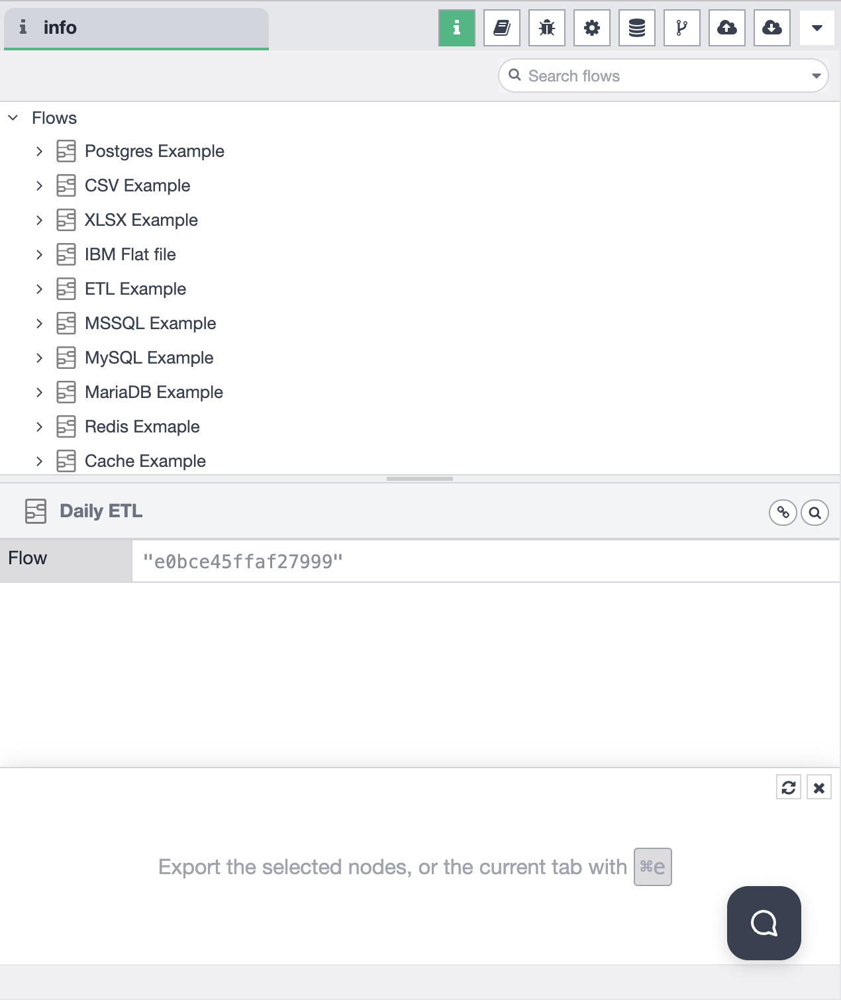

# Sidebar - Information

The Information panel in the sidebar provides essential details about the current workflow, nodes, and system status. The sidebar supports multiple functional modes that you can switch between to access different features.

## Sidebar Mode Selection

The sidebar allows you to choose from different functional modes. You can switch between modes using the mode selector in the sidebar:

Available modes include:
- **Information** — view workflow and node information
- **Help** — access help documentation and guides
- **Debug Messages** — monitor debug output and logs
- **Configuration Nodes** — manage configuration nodes
- **Context Data** — view and manage context data
- **Git Version Control** — manage Git operations
- **File Upload** — upload files to the system
- **File Download** — download files from the system

## Information Mode Features

When the Information mode is selected, the sidebar provides comprehensive workflow and node management capabilities:

### Global Search

The Information panel includes a powerful global search functionality that allows you to:

- **Search across all tabs** — find content across all workflow tabs
- **Search flows** — quickly locate specific flows by name or ID
- **Search nodes** — find nodes used in any workflow tab

### Tab and Node Inspection

The Information panel displays a hierarchical view of your workflows and allows you to:

- **View all tabs** — see all open workflow tabs in a collapsible tree structure
- **Inspect node usage** — view which nodes are used in each tab
- **Navigate workflows** — quickly switch between different workflows
- **View flow metadata** — see flow IDs and associated information

### Workflow Details

The Information panel displays:

- **Workflow metadata** — workflow name, description, and properties
- **Flow ID** — unique identifier for the current flow
- **Node information** — details about nodes used in the workflow
- **System status** — current system health and performance metrics

## Usage

1. **Select Information Mode** — Click on the Information icon in the sidebar mode selector
2. **Use Global Search** — Enter keywords in the search bar to find flows, nodes, or content across all tabs
3. **Browse Workflows** — Expand the workflow tree to see all tabs and their associated nodes
4. **Inspect Nodes** — Click on a workflow tab to see which nodes are used in that workflow

