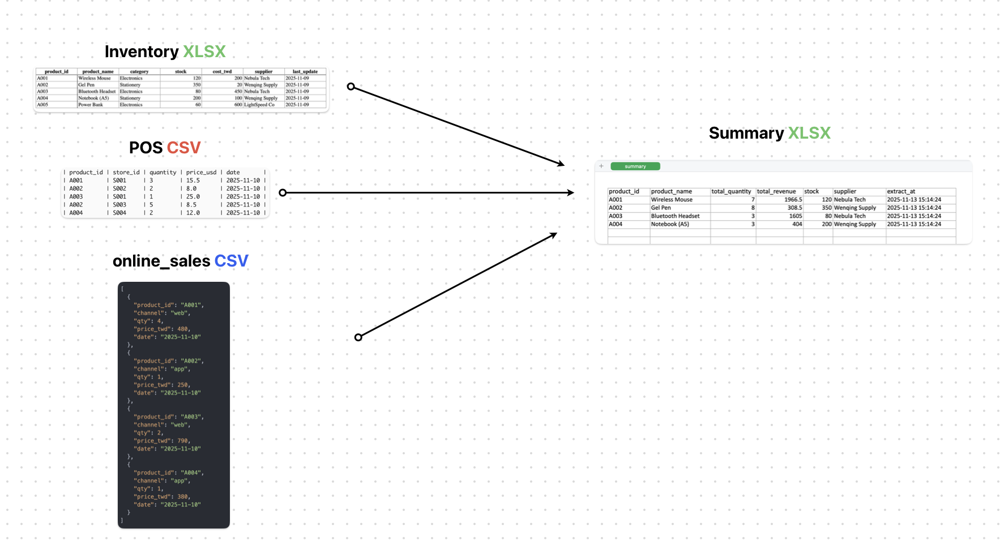

# Solution

## How Synstream Solves the Problem

Synstream provides a unified data processing pipeline that automates daily data collection, transformation, and consolidation from multiple sources. This solution eliminates manual processes, reduces errors, and provides real-time visibility into business operations.

## Solution Overview

The ETL workflow is designed to run automatically every day at 3 AM, collecting and processing data from multiple sources to produce a unified result that can be accessed by business intelligence tools.

### Data Flow Architecture

The solution processes data through a streamlined pipeline that handles multiple data formats in parallel:

1. **Scheduled Trigger** — A cron job starts the workflow daily at 3 AM
2. **Parallel Data Extraction** — The system forks into three parallel paths to extract data simultaneously:
   - **XLSX Extraction** — Reads `inventory.xlsx` from supplier updates
   - **JSON Extraction** — Retrieves `online_sales.json` from the e-commerce API
   - **CSV Extraction** — Processes `POS.csv` files uploaded by store POS systems
3. **Data Transformation** — Each extracted data stream is processed through transformation functions to standardize formats and validate data quality
4. **Data Consolidation** — All three transformed data streams are joined together, integrating sales and inventory data with unified field structures
5. **Final Processing** — Additional transformations ensure data consistency and completeness
6. **Timing Logging** — The TimeTrace node records processing metrics for monitoring and optimization
7. **Data Loading** — The unified dataset is loaded into XLSX format and uploaded to the cloud data warehouse
8. **Completion** — The ETL process completes, making the data available for Power BI and other reporting tools

By 6 AM, the marketing department can access the latest omnichannel sales reports with all data sources integrated and ready for analysis.

### Data Sources and Output

The workflow processes three different data source formats and consolidates them into a unified summary:

**Input Data Sources:**
- **Inventory XLSX** — Contains product information including `product_id`, `product_name`, `category`, `stock`, `cost_twd`, `supplier`, and `last_update`
- **POS CSV** — Contains in-store sales data with `product_id`, `store_id`, `quantity`, `price_usd`, and `date`
- **Online Sales JSON** — Contains e-commerce sales data with `product_id`, `channel`, `qty`, `price_twd`, and `date`

**Output Result:**
- **Summary XLSX** — Unified dataset with aggregated metrics including `product_id`, `product_name`, `total_quantity` (combined from POS and online sales), `total_revenue`, `stock`, `supplier`, and `extract_at` timestamp

The system automatically aggregates sales quantities and revenues from both physical stores and online channels, while enriching the data with inventory and supplier information from the inventory file.

### Results

- **Reduced Processing Time** — from hours to minutes
- **Improved Data Quality** — automated validation and error handling
- **Enhanced Visibility** — real-time dashboards and reports
- **Scalable Solution** — handles growing data volumes automatically

## Implementation

For detailed implementation guides, architecture documentation, and technical specifications, see the [Developer Documentation](/developers/intro).

### Benefits

By implementing this automated ETL workflow, Nebula Retail achieves:

- **Automated Data Collection** — No manual intervention required; data is automatically collected from POS systems, e-commerce APIs, and supplier files at 3 AM daily
- **Unified Data Format** — All data sources (CSV, JSON, XLSX) are transformed and consolidated into a single, consistent format
- **Time Efficiency** — Data processing completes automatically, allowing marketing teams to access fresh reports by 6 AM without waiting for manual data preparation
- **Data Accuracy** — Automated processing eliminates human errors in data entry and consolidation
- **Real-Time Insights** — Daily updated omnichannel sales reports enable faster decision-making and trend identification
- **Scalability** — The system handles growing data volumes from multiple stores and channels without additional manual effort
- **Single Source of Truth** — All business intelligence tools (like Power BI) access the same unified dataset, ensuring consistency across reports

## Next Steps

- [Developer Documentation](/developers/intro) — learn about detailed implementation and architecture
- [Overview](./overview) — review the background and challenges

