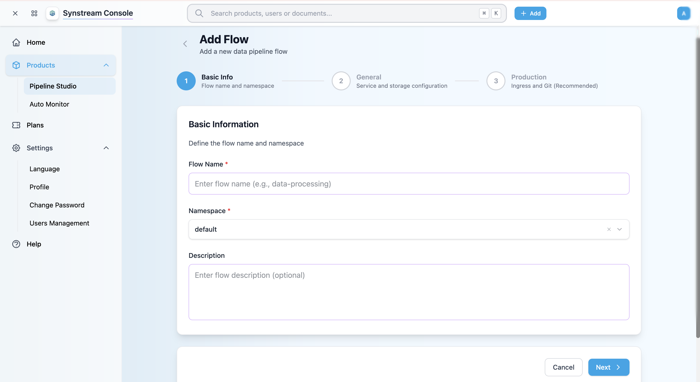
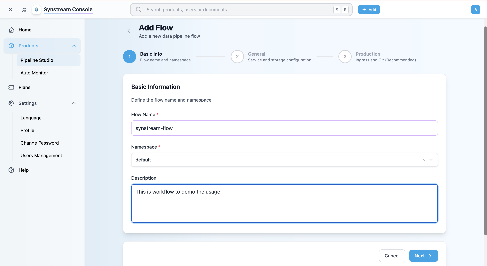
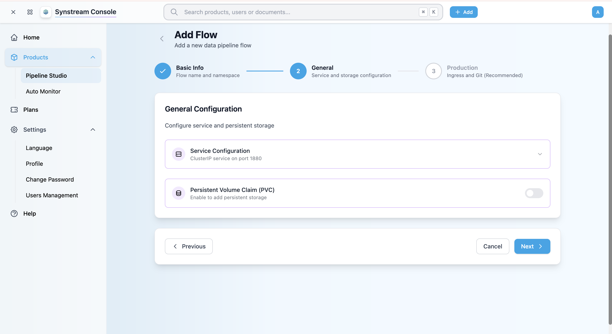
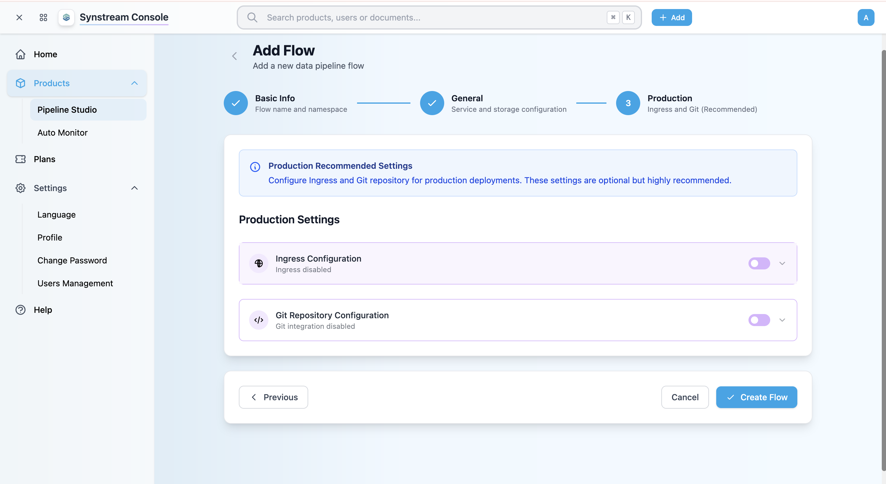

# Create Product

This guide shows you how to create a new product (flow) in the Synstream Console. Each product contains its own Pipeline Studio where you can design and manage automation flows.

**Note:** Only users with **Owner** role can create, modify, or delete products.

## Prerequisites

- Logged into the Synstream Console
- **Owner** role permissions (required for creating products)

## Step 1: Navigate to Pipeline Studio

1. In the Console, navigate to **Products** → **Pipeline Studio** from the left sidebar
2. You'll see the Pipeline Studio page with a list of your existing products (if any)

## Step 2: Start Creating a New Product

1. Click the **+ Add Flow** button in the top right of the Pipeline Studio page
2. The "Add Flow" wizard will open, guiding you through three steps to create a new product

## Step 3: Basic Information (Step 1)

The first step of the wizard is "Basic Info" where you define the flow name and namespace.

### Fill in Basic Information

1. **Flow Name** (required)
   - Enter a descriptive name for your product/flow
   - Example: "data-processing", "etl-demo", "customer-onboarding"
   - The name should be lowercase and use hyphens for spaces

   

2. **Namespace** (required)
   - Select or enter a Kubernetes namespace
   - Default value is "default"
   - You can select from existing namespaces or create a new one

3. **Description** (optional)
   - Provide a brief description of the product's purpose
   - Example: "This is workflow to demo the usage."

4. Click **Next >** to proceed to the next step

## Step 4: General Configuration (Step 2)

The second step is "General" where you configure service and storage settings.

### Service Configuration

1. **Service Configuration**
   - By default, a ClusterIP service is configured on port 1880
   - Click the dropdown arrow to view or modify service settings:
     - Service type (ClusterIP, NodePort, LoadBalancer)
     - Port configuration
     - Service annotations

### Persistent Volume Claim (PVC)

1. **Persistent Volume Claim (PVC)**
   - Toggle the switch to enable persistent storage
   - When enabled, you can configure:
     - Storage class
     - Storage size
     - Access modes
   - **Note:** Persistent storage is recommended for production environments to preserve data across pod restarts

2. Click **Next >** to proceed to the final step

## Step 5: Production Settings (Step 3)

The third and final step is "Production" where you can configure Ingress and Git integration. **These settings are optional but highly recommended for production deployments.**

### Production Recommended Settings

The wizard displays an information box indicating:
> "Configure Ingress and Git repository for production deployments. These settings are optional but highly recommended."

### Ingress Configuration

1. **Enable Ingress**
   - Toggle the switch to enable Ingress configuration
   - When enabled, you can configure:
     - Ingress hostname (e.g., "etldemo1.rtsinv.com")
     - TLS/SSL certificates
     - Ingress annotations
     - Path routing rules

2. **Benefits of Ingress:**
   - External access to your pipeline
   - Custom domain names
   - SSL/TLS termination
   - Load balancing

### Git Repository Configuration

1. **Enable Git Integration**
   - Toggle the switch to enable Git repository integration
   - When enabled, you can configure:
     - Git provider (GitHub, GitLab, Bitbucket)
     - Repository URL
     - Branch name
     - Authentication credentials
     - Sync settings

2. **Benefits of Git Integration:**
   - Version control for your pipeline flows
   - Collaboration and code review
   - Automated deployments
   - Backup and recovery

### Complete the Wizard

1. Review all your settings
2. Click **✓ Create Flow** to create the product
3. Or click **< Previous** to go back and modify settings
4. Or click **Cancel** to abort the creation process

## Step 6: Verify Product Creation

After clicking "Create Flow":

1. You'll be redirected to the Pipeline Studio page
2. Your new product will appear in the products list
3. The status will show as "Progressing" while the product is being created
4. Once ready, the status will change to "Ready"

## Product Status

After creation, products can have the following statuses:

- **Progressing** — product is being created or updated
- **Ready** — product is ready and operational
- **Error** — product has encountered an error during creation

## Next Steps

- [Enter Product](./enter-product) — access your product's Pipeline Studio from the Console to start designing flows
- Review [Architecture](https://rootsinnovation.github.io/synstream-docs/developers/architecture/architecture) to understand pipeline architecture

## Troubleshooting

### Product Creation Fails

- Verify you have **Owner** role permissions
- Check that your workspace has available resources
- Ensure the namespace exists (if using a custom namespace)
- Contact support at [contact.us@rtsinv.com](mailto:contact.us@rtsinv.com) if the issue persists

### Ingress Configuration Issues

- Verify your Ingress controller is installed and running
- Check that the hostname is available and DNS is configured
- Ensure TLS certificates are valid (if using HTTPS)

### Git Integration Issues

- Ensure your Git credentials are valid
- Verify repository access permissions
- Check network connectivity to your Git provider
- Confirm the repository URL and branch name are correct

## Important Notes

- **Permissions:** Only users with **Owner** role can create, modify, or delete products
- **Production Settings:** Ingress and Git integration are optional but highly recommended for production environments
- **Namespace:** Choose an appropriate namespace for your product to organize resources
- **Storage:** Enable PVC for production environments to ensure data persistence
