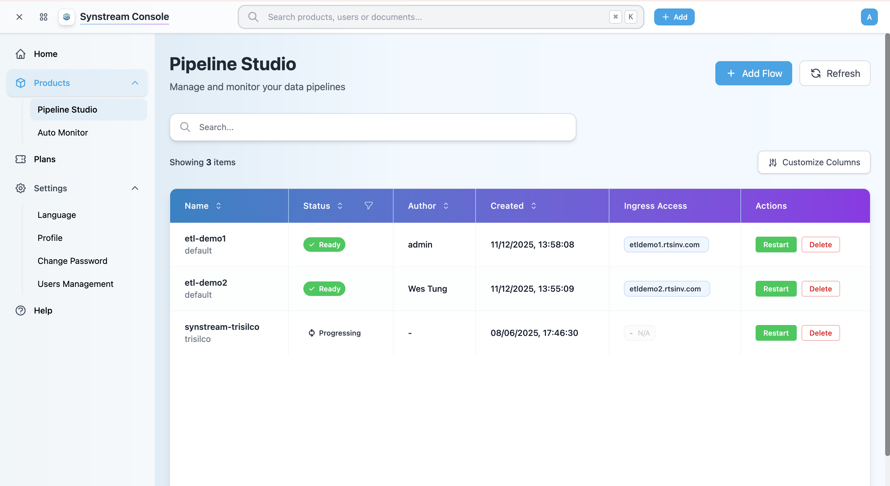
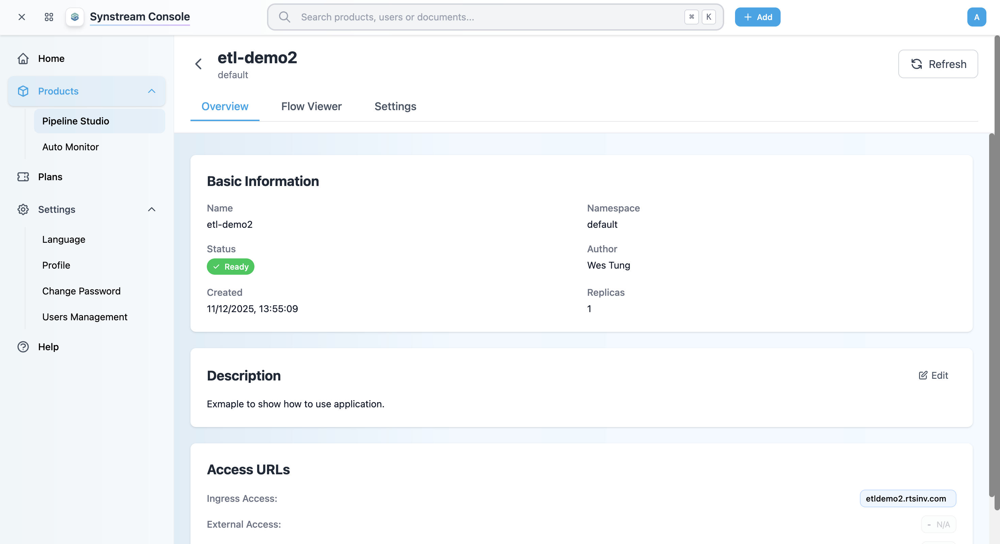
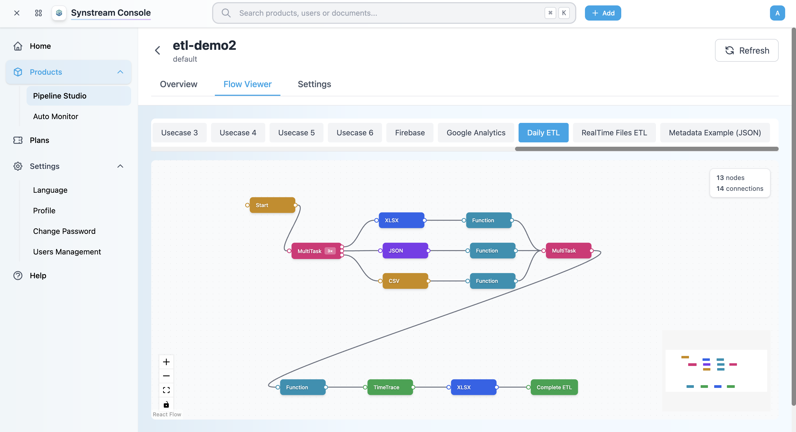
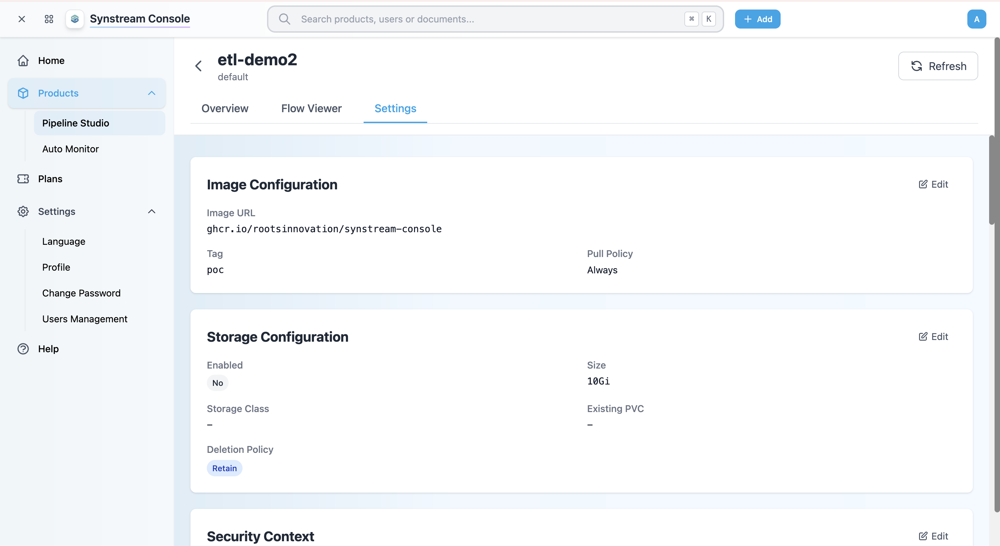

# Enter Product

Learn how to access your product's details and Pipeline Studio from the Synstream Console. You can view product information, preview flows, configure settings, or access the workflow designer directly.

## Prerequisites

- Logged into the Synstream Console
- A product must be created (see [Create Product](./create-product))

## Step 1: Access Products List

1. In the Console, navigate to **Products** → **Pipeline Studio** from the left sidebar
2. You'll see a list of all products in your workspace

The products list displays:
- **Name** — product name and namespace
- **Status** — product status (Ready, Progressing, Error, etc.)
- **Author** — user who created the product
- **Created** — product creation date and time
- **Ingress Access** — ingress URL for accessing the product
- **Actions** — restart or delete product

## Step 2: Access Product Details

There are two ways to access a product:

### Option 1: View Product Details in Console

1. In the products list, click on the **product name** (e.g., "etl-demo2")
2. You'll be redirected to the product details page in the Console

The product details page has three tabs:

#### Overview Tab

The **Overview** tab displays:

- **Basic Information**
  - Name
  - Status (Ready, Progressing, Error, etc.)
  - Created date and time
  - Namespace
  - Author
  - Replicas

- **Description**
  - Product description (editable)
  - Click **Edit** to modify the description

- **Access URLs**
  - **Ingress Access** — clickable link to access the workflow designer
  - **External Access** — external access URL (if configured)

#### Flow Viewer Tab

The **Flow Viewer** tab shows a visual preview of your workflow:

- **Use Case Tabs** — switch between different use cases/flows (e.g., "Daily ETL", "Firebase", "Google Analytics")
- **Flow Diagram** — visual representation of your workflow with nodes and connections
- **Flow Statistics** — number of nodes and connections
- **Zoom Controls** — zoom in/out, fit to screen, lock view
- **Mini-map** — overview of the entire flow

#### Settings Tab

The **Settings** tab allows you to configure product settings:

- **Image Configuration**
  - Image URL
  - Tag
  - Pull Policy
  - Click **Edit** to modify image settings

- **Storage Configuration**
  - Enabled/Disabled
  - Size
  - Storage Class
  - Existing PVC
  - Deletion Policy
  - Click **Edit** to modify storage settings

- **Security Context**
  - Security context settings
  - Click **Edit** to modify security settings

### Option 2: Access Workflow Designer via Ingress (SSO Auto-Login)

1. In the products list, find the product you want to access
2. Click on the **Ingress Access** URL (e.g., "etldemo2.rtsinv.com")
3. You'll be automatically redirected to the workflow designer with **SSO auto-login**
4. No additional login is required — you're automatically authenticated

## Step 3: Navigate the Workflow Designer Interface

The Workflow Designer (accessed via Ingress) consists of several key areas:

### Top Navigation Bar

- **Product Name** — displays the current product
- **Use Case Tabs** — switch between different pipeline flows (Usecase 5, Usecase 6, Firebase, Daily ETL, etc.)
- **Deploy** — deploy your pipeline to the target environment
- **Menu** — access settings and additional options
- **User Profile** — view your profile and logout

### Left Sidebar

- **Node Library** — browse available nodes and connectors
- **Filter Nodes** — search for specific nodes by name or category (e.g., "Q filter nodes")
- **Node Categories**:
  - **Common** — inject, debug, complete, catch, status, link in/out, comment, Start
  - **Extract and Load** — XLSX, JSON, CSV, etc.
  - **Transform** — MultiTask, Function, Hash, etc.
  - And more...

### Main Canvas

- **Grid Background** — drag-and-drop area for building flows
- **Node Connections** — connect nodes to create workflow logic
- **Node Status** — view execution status (ready, running, error, etc.)
- **Flow Statistics** — displays number of nodes and connections

### Right Sidebar

- **Git Integration** — view Git status, stage changes, commit, and push
  - Branch information
  - Git status (Has changes, etc.)
  - Actions: Stage All, Commit, Push
  - Changed files list
- **Git History** — browse commit history and reset to previous versions
  - Feature branches
  - Commit IDs and dates
  - Reset to previous versions

### Bottom Bar

- **License Status** — displays license information
- **Zoom Controls** — zoom in/out for the canvas
- **Help/Chat** — access help and support

## Step 4: Create Your First Flow

1. **Add a Start Node**
   - Drag a **Start (cron)** node from the node library to the canvas
   - Configure the cron schedule (e.g., "0 9 * * *" for daily at 9 AM)

2. **Add Processing Nodes**
   - Drag nodes from the library to the canvas
   - Connect nodes by dragging from one node's output to another's input
   - Configure each node's properties in the right sidebar
   - Common node types:
     - **Extract Nodes** — XLSX, JSON, CSV (for data extraction)
     - **Transform Nodes** — Function, MultiTask, Hash (for data transformation)
     - **Load Nodes** — XLSX, JSON, CSV (for data loading)

3. **Add an End Node**
   - Add a **Complete** node to mark the end of your flow
   - Connect the final processing node to the Complete node

4. **Save Your Flow**
   - Click **Save** or use Git to commit your changes
   - Your flow is automatically saved to the studio

## Step 5: Deploy Your Pipeline

1. Click the **Deploy** button in the top navigation
2. Select the target environment
3. Review the deployment configuration
4. Click **Deploy** to publish your pipeline

## Tips for Using Workflow Designer

- **Use Keyboard Shortcuts** — press `?` to view available shortcuts
- **Zoom and Pan** — use mouse wheel to zoom, drag to pan the canvas
- **Node Search** — use the filter bar to quickly find nodes
- **Version Control** — commit frequently to track changes in Git
- **Test Before Deploy** — use the debug node to test individual components
- **MultiTask Nodes** — use Fork and Join nodes for parallel processing
- **Time Trace** — use Time Trace nodes to monitor execution time

## Access Methods Summary

| Method | Access Point | Use Case |
|--------|-------------|----------|
| **Product Details** | Click product name | View product information, preview flows, configure settings |
| **Workflow Designer** | Click Ingress Access URL | Design and edit workflows with SSO auto-login |

## Next Steps

- Review [Architecture](https://rootsinnovation.github.io/synstream-docs/developers/architecture/architecture) to understand flow design principles
- Check [Troubleshooting](../troubleshooting/faq) for common issues
- Explore [Examples](../examples/overview) for workflow patterns

## Troubleshooting

### Cannot Access Product

- Verify you have the necessary permissions in the Console
- Check that the product status is "Ready"
- Ensure the product was created successfully
- Contact your workspace admin if access is denied

### Ingress Access Not Working

- Verify Ingress is configured for the product (see [Create Product](./create-product))
- Check that the Ingress URL is correct
- Ensure DNS is configured properly
- Verify network connectivity to the Ingress endpoint

### SSO Auto-Login Fails

- Check that you're logged into the Console
- Verify your session is still valid
- Try logging out and logging back into the Console
- Clear browser cache and cookies if issues persist

### Workflow Designer Loads Slowly

- Check your network connection
- Clear browser cache and reload
- Try a different browser if issues persist
- Verify the product is in "Ready" status

### Git Integration Not Working

- Verify Git credentials are configured in product settings
- Check repository permissions
- Ensure network connectivity to Git provider
- Review Git status in the right sidebar

### Cannot See Flow Preview

- Ensure flows are saved and committed
- Check that the product has active flows
- Verify you have appropriate permissions to view flows
- Refresh the page to reload flow data
