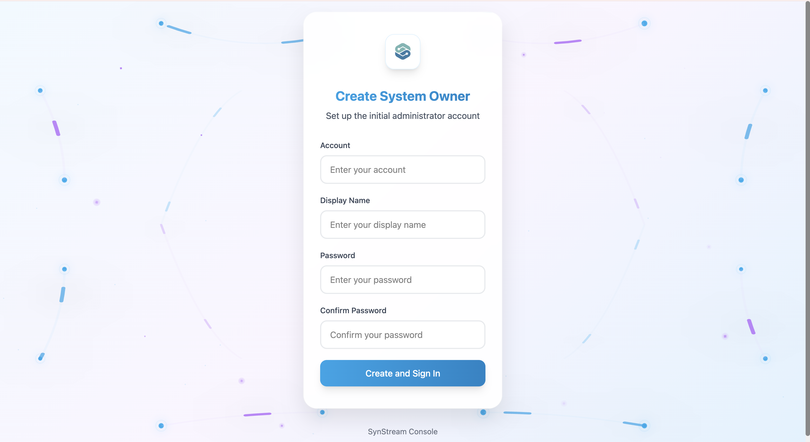
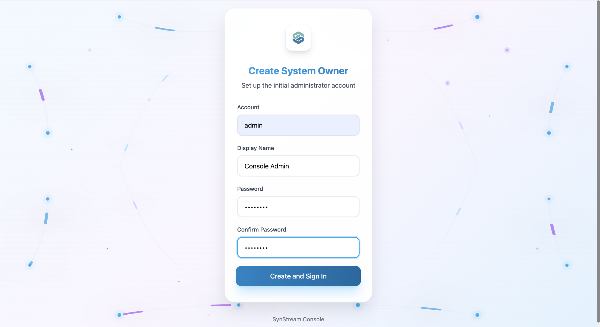
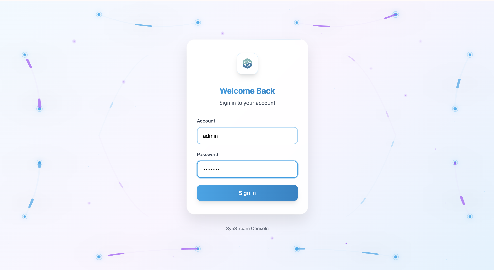

# Register and Login

This guide shows you how to access the Synstream Console, register a new account, and log in.

## Prerequisites

- Synstream Console deployed and accessible
- Valid email address
- Network access to your Synstream Console instance

## Step 1: Access the Console

The way you access the Synstream Console depends on your deployment method:

### Cloud Deployment
If you deployed Synstream Console in the cloud:
1. Navigate to the Console URL provided by your administrator
2. The URL typically follows the pattern: `https://console.your-domain.com`

### On-Premises Deployment
If you deployed Synstream Console on-premises:
1. Access the Console through your internal network
2. Use the URL configured during installation (e.g., `https://synstream-console.internal.company.com`)
3. Ensure you have network access to the Console instance

### Kubernetes Deployment
If you deployed using Helm (as described in [Quickstart](/docs/getting-started/quickstart)):
1. Access the Console through the Ingress controller you configured
2. Check your Ingress configuration for the Console URL
3. The URL depends on your Ingress setup and domain configuration

Once you access the Console URL, you'll see the login page.

## Step 2: Register Your Account

If this is your first time accessing the Console, you'll need to create a System Owner account.

### Initial Setup

1. **Access the Signup Page**
   - When you first access the Console, you'll see the "Create System Owner" form
   - This form is used to create the initial administrator account

   

2. **Fill in Account Information**
   - **Account**: Enter your account name (e.g., "admin")
   - **Display Name**: Enter your display name (e.g., "Console Admin")
   - **Password**: Create a secure password
   - **Confirm Password**: Re-enter your password to confirm

   

3. **Create Account**
   - Click the **Create and Sign In** button
   - Your account will be created and you'll be automatically signed in

### Subsequent User Registration

After the System Owner account is created, additional users can register:

1. Navigate to the Console login page
2. Look for a "Sign Up" or "Register" link
3. Fill in the registration form with:
   - Email address
   - Display name
   - Password
   - Confirm password
4. Complete email verification if required
5. Accept the terms of service and privacy policy

## Step 3: Log into Console

Once you have an account, you can log into the Console.

### Login Process

1. **Access the Login Page**
   - Navigate to the Synstream Console URL
   - You'll see the login form

   

2. **Enter Your Credentials**
   - **Account**: Enter your account name or email address
   - **Password**: Enter your password

   

3. **Sign In**
   - Click the **Sign In** button
   - You'll be redirected to the Console dashboard

## Step 4: Access the Console

Upon successful login, you'll be redirected to the Synstream Console. From the Console, you can:

- **Manage Users and Licenses** — add team members, manage roles, and configure licenses
- **Create and Manage Products** — create new products and configure settings
- **Access Product Settings** — configure Git integration, storage, and permissions
- **Navigate to Pipeline Studios** — access your products' Pipeline Studios to design flows

## Troubleshooting

### Forgot Password

If you forgot your password:

1. Contact your system administrator
2. The administrator can reset your password from the Console
3. After the password is reset, you'll receive a notification with your new temporary password
4. Log in with the temporary password and change it to a new password of your choice

### Cannot Access Console

- **Check Network Connectivity**: Ensure you can reach the Console URL
- **Verify Deployment**: Confirm that the Console is running and accessible
- **Check Ingress Configuration**: If using Kubernetes, verify your Ingress settings
- **Contact Administrator**: Reach out to your system administrator for access issues

## Next Steps

- [Users and Products Management](./users-products) — manage users, licenses, and products in the Console
- [Create Product](./create-product) — create a new product from the Console
