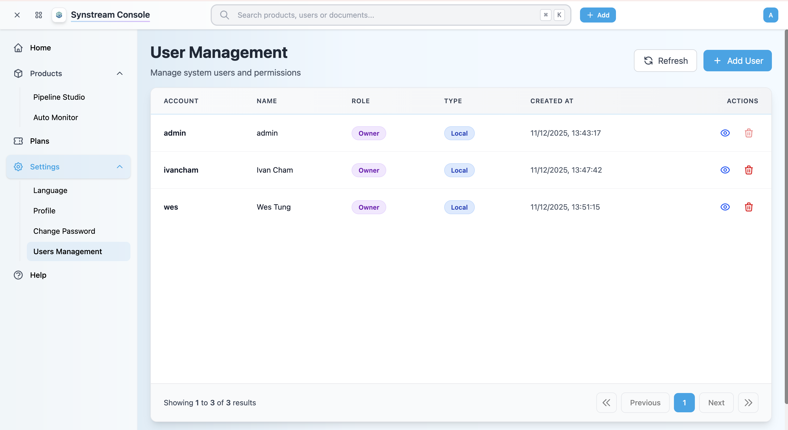
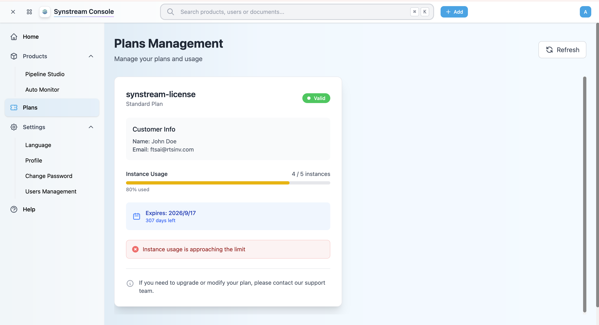

# Users and Products Management

Learn how to manage users, plans, and products in the Synstream Console.

## User Management

The User Management section allows you to manage system users and permissions. **Only users with Owner role can access this section.**

### Access User Management

1. In the Console, navigate to **Settings** → **Users Management** from the left sidebar
2. You'll see the User Management page with a list of all users

### View Users

The User Management page displays:
- **Account** — user account name
- **Name** — user display name
- **Role** — user role (Owner, Member, Viewer, Dashboard-only)
- **Type** — user type (Local, External)
- **Created At** — account creation date and time
- **Actions** — view details or delete user

### Add User

**Only users with Owner role can add new users.**

1. In the User Management page, click the **+ Add User** button
2. Fill in the user information:
   - **Account**: Enter the account name
   - **Name**: Enter the display name
   - **Password**: Set a password for the user
   - **Role**: Select the user role (Owner, Member, Viewer, Dashboard-only)
   - **Type**: Select the user type (Local, External)
3. Click **Create** to add the user

### Edit User

**Only users with Owner role can edit users.**

1. In the User Management page, find the user you want to edit
2. Click the **View** icon (eye icon) in the Actions column
3. Update the user information:
   - **Name**: Change the display name
   - **Role**: Change the user role
   - **Password**: Reset the password
4. Click **Save** to apply changes

### Delete User

**Only users with Owner role can delete users.**

1. In the User Management page, find the user you want to delete
2. Click the **Delete** icon (trash icon) in the Actions column
3. Confirm the deletion
4. The user will be removed from the system

**Note:** Deleting a user will remove all associated access and permissions. This action cannot be undone.

### User Roles

Synstream supports the following roles:

- **Owner** — full access to all features, settings, and management functions (user management, product creation/modification/deletion)
- **Member** — can create and modify pipelines, view logs and metrics, access dashboard features
- **Viewer** — read-only access to pipelines and dashboards
- **Dashboard-only** — access limited to dashboard views only, cannot view or modify pipelines

## Plan Management

The Plan Management section allows you to view your current plan, usage, and expiration information.

### Access Plan Management

1. In the Console, navigate to **Plans** from the left sidebar
2. You'll see the Plans Management page with your current plan details

### View Plan Details

The Plan Management page displays:

- **Plan Name** — your current plan name (e.g., "synstream-license")
- **Plan Type** — your plan type (e.g., "Standard Plan")
- **Status** — plan status (Valid, Expired, etc.)
- **Customer Info** — customer name and email
- **Instance Usage** — current instance usage with progress bar
- **Expiration** — plan expiration date and days remaining

### Instance Usage

The Instance Usage section shows:
- **Progress Bar** — visual representation of usage percentage
- **Usage Count** — current number of instances used (e.g., "4/5 instances")
- **Warning Messages** — alerts when usage is approaching limits

### Upgrade or Modify Plan

**To upgrade or modify your plan, you must contact support.**

1. If you need to upgrade your plan or modify your subscription:
   - Contact support at [contact.us@rtsinv.com](mailto:contact.us@rtsinv.com)
   - Provide your plan details and requirements
   - Support will assist you with plan upgrades or modifications

2. Plan changes may include:
   - Increasing instance limits
   - Upgrading to a higher tier plan
   - Modifying subscription terms
   - Renewing expired plans

## Product Management

The Product Management section allows you to create, manage, and delete products. **Only users with Owner role can create, modify, or delete products.**

### Access Product Management

1. In the Console, navigate to **Products** → **Pipeline Studio** from the left sidebar
2. You'll see the Pipeline Studio page with a list of all products

### View Products

The Pipeline Studio page displays:
- **Name** — product name and namespace
- **Status** — product status (Ready, Progressing, Error, etc.)
- **Author** — user who created the product
- **Created** — product creation date and time
- **Ingress Access** — ingress URL for accessing the product
- **Actions** — restart or delete product

### Create Product

**Only users with Owner role can create products.**

1. In the Pipeline Studio page, click the **+ Add Flow** button
2. Fill in the product configuration:
   - **Name**: Enter a name for the product
   - **Namespace**: Select or enter a namespace
   - **Description**: (Optional) Provide a description
3. Click **Create** to create the product

### Restart Product

**Only users with Owner role can restart products.**

1. In the Pipeline Studio page, find the product you want to restart
2. Click the **Restart** button in the Actions column
3. Confirm the restart action
4. The product will be restarted and its status will update

### Delete Product

**Only users with Owner role can delete products.**

1. In the Pipeline Studio page, find the product you want to delete
2. Click the **Delete** button in the Actions column
3. Confirm the deletion
4. The product will be deleted from the system

**Note:** Deleting a product will also delete all associated pipelines and data. This action cannot be undone.

### Product Status

Products can have the following statuses:

- **Ready** — product is ready and operational
- **Progressing** — product is being created or updated
- **Error** — product has encountered an error
- **Stopped** — product has been stopped

## Next Steps

- [Create Product](./create-product) — detailed guide on creating products
- [Enter Product](./enter-product) — access your product's Pipeline Studio from the Console
